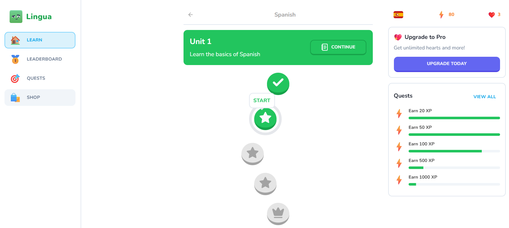

# Lingua

This is a full-stack web application, integrating postreSQL database and server-side with Node.js with dynamic client-side rendering.

It was based off characteristics of the Language Learning SaaS, Duolingo.

## Key Features

+ **Next.js 14 & Server Actions:** Utilizing the latest version of Next.js along with server actions for seamless user experience.
+ **AI Voices with Elevenlabs AI:** Enjoy lifelike AI-generated voices for enhanced learning.
+ **Beautiful Component System with Shadcn UI:** Immerse yourself in stunning visuals and intuitive interface design.
+ **Amazing Characters by KenneyNL:** Engage with charming characters to make your learning experience more enjoyable.
+ **Auth Using Clerk:** Secure authentication powered by Clerk for peace of mind.
+ **Sound Effects:** Enhance your learning journey with immersive audio cues.
+ **Hearts System:** Manage your progress with our intuitive hearts system.
+ **Points / XP System:** Earn points and XP as you progress through your language courses.
+ **No Hearts Left Popup:** Stay informed with prompts when your hearts are running low.
+ **Exit Confirmation Popup:** Prevent accidental exits with our confirmation popups.
+ **Practice Old Lessons:** Reinforce your learning by revisiting previous lessons to regain hearts.
+ **Leaderboard:** Compete with fellow learners and climb the ranks on our leaderboard.
+ **Quests Milestones:** Set and achieve milestones on your learning journey with our quest system.
+ **Shop System:** Exchange points for rewards in our virtual shop.
+ **Pro Tier with Stripe:** Unlock unlimited hearts and exclusive features with our Pro tier subscription powered by Stripe.
+ **Landing Page:** Welcome to our platform with our engaging and informative landing page.
+ **Admin Dashboard with React Admin:** Manage your platform with ease using our comprehensive admin dashboard.
+ **ORM with DrizzleORM:** Seamlessly interact with our database using DrizzleORM.
PostgresDB with NeonDB: Store and retrieve data efficiently with our PostgreSQL database powered by NeonDB.
+ **Deployment on Vercel:** Enjoy fast and reliable deployment on Vercel for optimal performance.
+ **Mobile Responsiveness:** Learn on the go with our fully responsive design, accessible on all devices.

### Usage

+ Sign up for an account or log in if you're an existing user.
+ Choose your desired language course from our selection.
+ Dive into guided lessons with our beautiful design, characters, audio, and visual effects.
+ Earn points, climb the leaderboard, and unlock rewards as you progress.
+ Explore our shop system to exchange points for exciting rewards.
+ Manage your learning journey and platform settings with our admin dashboard.
+ Have fun and immerse yourself in the joy of language learning!
